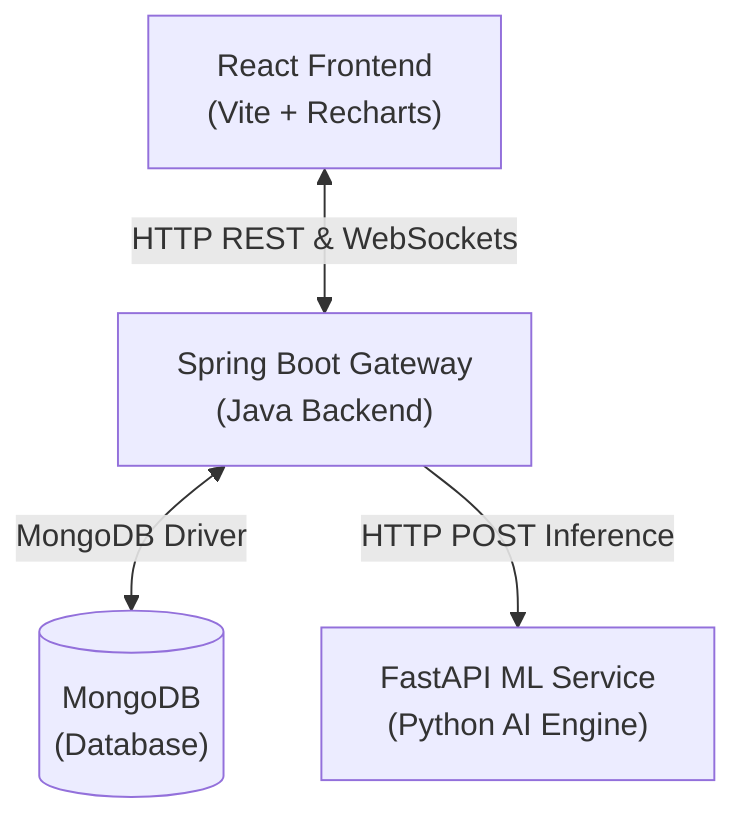
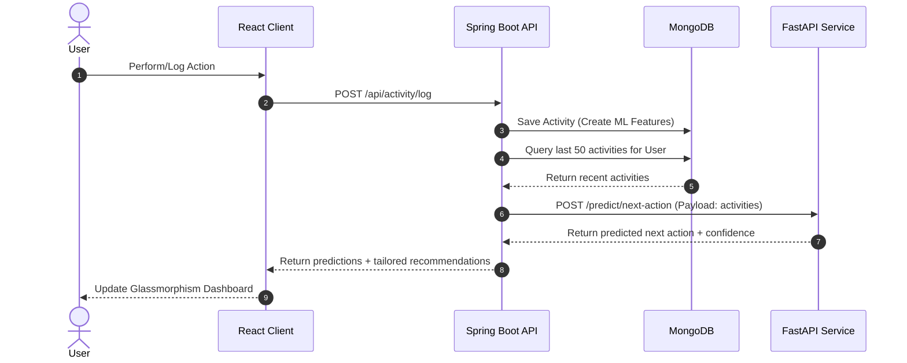

# Digital Twin Architecture & Data Flow

This document details the high-level system architecture and how telemetry data flows through the application components for behavior prediction.

## 🌐 Component Architecture

The application is structured as a decoupled microservices architecture:

## 🔄 Behavioral Telemetry & Prediction Flow

Whenever a user transitions between tasks, the data flows dynamically through the system:

## 🔌 WebSocket Alerts Flow
The real-time notification engine utilizes STOMP over WebSockets:
1. User logs a distraction task.
2. The Backend intercepts the event, checking if the current focus session rules are breached.
3. If breached, the Backend pushes a real-time warning message over `/topic/focus-breach` to the Frontend client.
4. The React dashboard instantly shows an alert notification advising the user to pause and reset.
